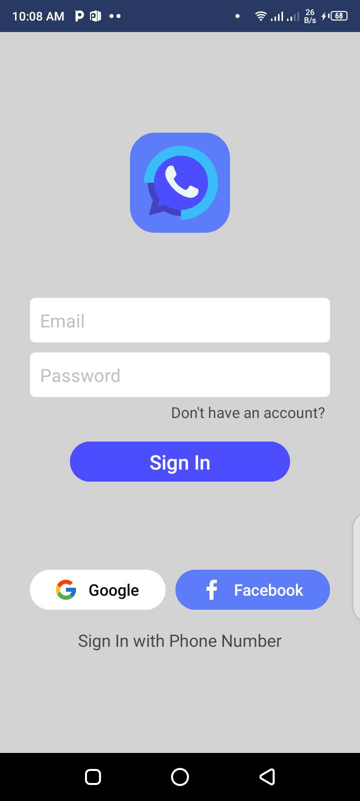
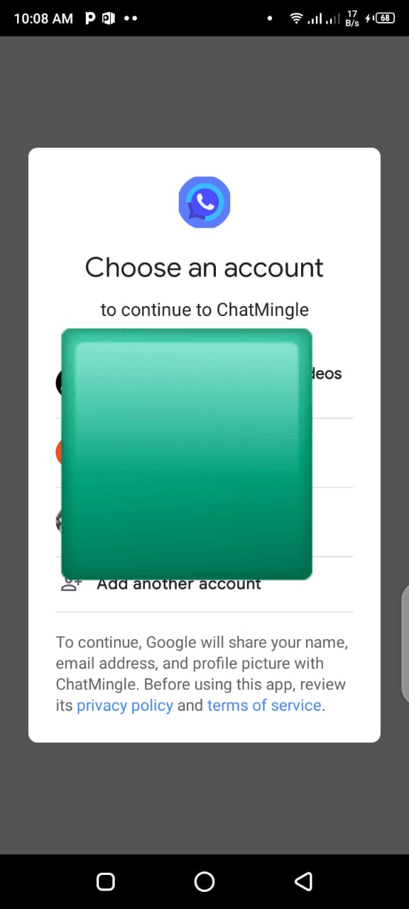
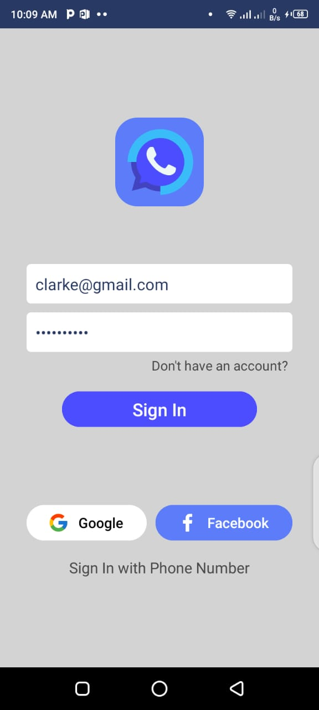
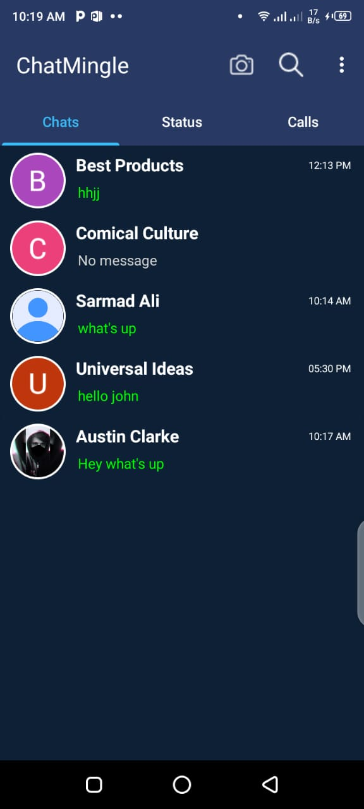
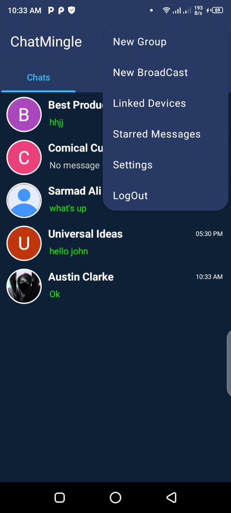
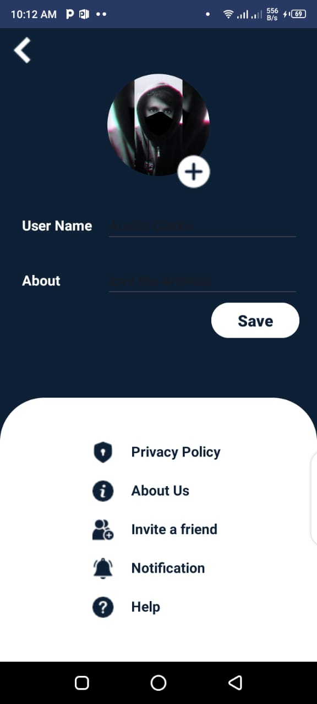
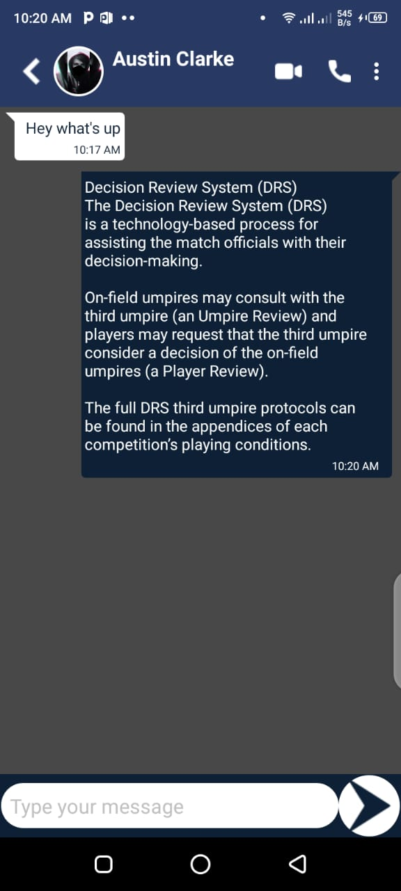
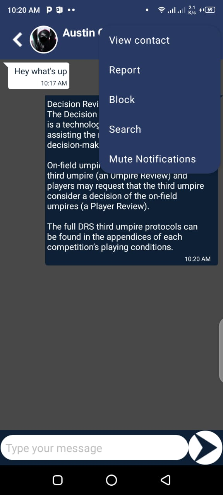

# ChatMingle
ChatMingle is a messaging application built on Android Studio, designed to provide a seamless communication experience. 
With its intuitive interface and robust features, ChatMingle aims to connect people from all around the world.

## Features
##### Real-time Messaging: 
Engage in instant conversations with friends and family.
#### Firebase Integration:
Utilizes Firebase for efficient data storage and retrieval.
#### Customizable Profiles: 
Personalize your profile with photos and status updates.
#### External Libraries: 
Incorporates popular libraries like Picasso and CircleImageView for enhanced functionality.

## Technologies Used:
#### Android Studio: 
Developed using the Android Studio IDE.
#### Java: 
Implemented using the Java programming language.
#### XML: 
Front-end design built with XML.
#### Firebase Database and Storage: 
Utilized for efficient data management and media storage.

## App Screen Shots:

#####  
Login Screen

#####  
Login With Google

#####  
Login With Email/Password

#####  
Home/Chat Screen

#####  
Home/App Settings

#####  
Profile

#####  
Chat Screen

#####  
Chat Settings

## Contributions:
I have worked on only chats. You can contribute to the status and call fragment and adding camera and calling functionalities in the app.
And account creation with Facebook and Phone Number.
Contributions are welcome! If you'd like to contribute to ChatMingle, please fork the repository and submit a pull request with your changes.
